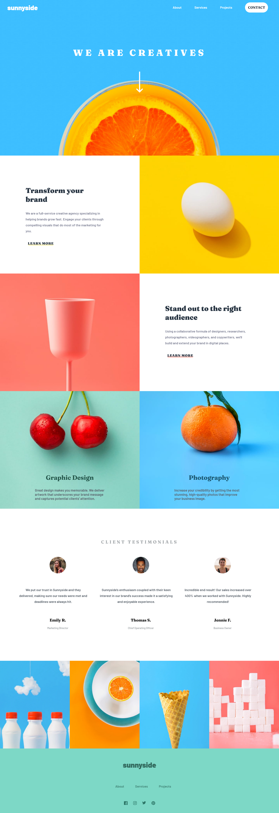
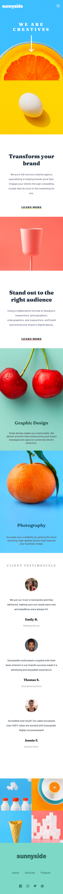
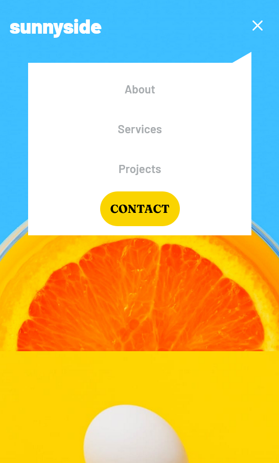

# Sunnyside agency landing page

## Table of contents

-   [Overview](#overview)
    -   [The challenge](#the-challenge)
    -   [Screenshot](#screenshot)
-   [My process](#my-process)
    -   [Built with](#built-with)
    -   [What I learned](#what-i-learned)

## Overview

### The challenge

Users should be able to:

-   View the optimal layout for the site depending on their device's screen size
-   See hover states for all interactive elements on the page

### Screenshot

#### Desktop Screenshot:



#### Mobile Screenshot:



### Links

-   Live Site URL: [Netlify](https://sharp-keller-7475b7.netlify.app/)

## My process

### Built with

-   Semantic HTML5 markup
-   Flexbox
-   CSS Grid
-   Mobile-first workflow
-   ReactJS

### What I learned

Pseudo-elements and clip-path magic.

Creating a pseudo-element on top on the nav-links div (Nav menu on mobile screens)



```
.nav-links::before {
        content: "";
        position: absolute;
        right: -2.5vw;
        top: -2%;
        background: white;
        height: 50px;
        width: 50px;
        transform: rotate(60deg) skew(0, 30deg);
        transition: 0.5s all;
    }
```

Using clip-path on the parent div so the element doesn't overflow from the necessary area.

```
clip-path: polygon(0 0, 100% -20%, 100% 100%, 0 100%);
```
